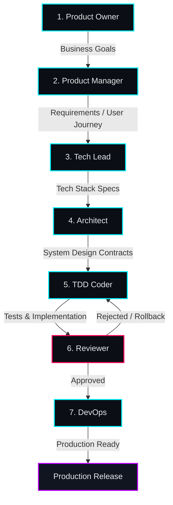

# Multi-Agent SDLC Team Overview & Handoffs

This directory contains the rules and workflow definitions for the role-based multi-agent SDLC team.

## Team Overview

The SDLC team consists of seven distinct roles, each operating within a strict workspace boundary to maintain separation of concerns and ensure high-quality software delivery:

| # | Role | Rule File | Allowed Workspace | Core Responsibility |
|---|------|-----------|-------------------|---------------------|
| 1 | **Product Owner (PO)** | [00_PO_RULES.md](00_PO_RULES.md) | `docs/BUSINESS_GOALS.md` | Defines business goals, vision, and KPIs. |
| 2 | **Product Manager (PM)** | [01_PM_RULES.md](01_PM_RULES.md) | `docs/REQUIREMENTS.md`, `docs/USER_JOURNEY.md` | Translates goals into functional requirements & user stories. |
| 3 | **Technical Lead** | [02_TECH_LEAD_RULES.md](02_TECH_LEAD_RULES.md) | `docs/TECH_STACK.md` | Reviews technical feasibility and enforces code/bundle size standards. |
| 4 | **Architect** | [03_ARCHITECT_RULES.md](03_ARCHITECT_RULES.md) | `docs/SYSTEM_DESIGN.md` | Designs schemas, API contracts, and component interfaces. |
| 5 | **TDD Coder** | [04_CODER_RULES.md](04_CODER_RULES.md) | `src/`, `tests/` | Implements features using a test-driven development (TDD) approach. |
| 6 | **Reviewer** | [05_REVIEWER_RULES.md](05_REVIEWER_RULES.md) | reads `src/`+`tests/`, writes `docs/REVIEWS.md` | Audits code for security, requirements coverage, and quality. |
| 7 | **DevOps** | [06_DEVOPS_RULES.md](06_DEVOPS_RULES.md) | `.github/`, `scripts/`, `Dockerfile`, CI | Manages builds, pipeline checks, and production readiness. |

---

## Handoff Diagram

The workflow proceeds sequentially from ideation to production. If the Reviewer detects quality gaps or missed acceptance criteria, the task is rolled back to the Coder for refinement.

---

## SDLC Protocol

1. **Workspace Boundary**: Under no circumstances should an agent write to files outside their designated role's allowed workspace.
2. **Status Updates**: Every handoff must be logged in [../STATUS.md](../STATUS.md). Update the "Current Stage", log the date/time, list the deliverables, and ping the next role in the chain.
3. **Red-Green-Refactor**: The Coder must write failing tests first, verify they fail, implement the fix, and then refactor while keeping tests green.
