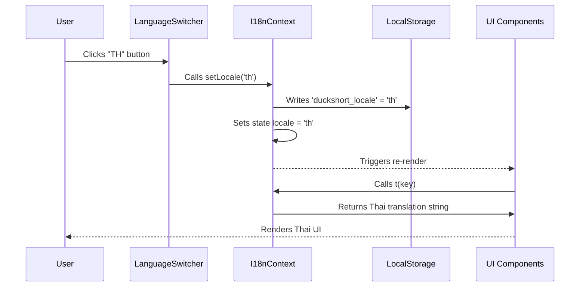

# System Design: Additional Locales (Thai)

This document details the system design, data flows, and component architecture for the localization feature.

## Component Hierarchy & Contracts

### 1. `I18nProvider` / `useTranslation`
- **Location**: `frontend/src/lib/i18n.tsx`
- **Context Type**:
  ```typescript
  export type Locale = 'en' | 'th';

  interface I18nContextType {
    t: (key: string, params?: TranslationParams) => string;
    locale: Locale;
    setLocale: (locale: Locale) => void;
  }
  ```
- **Translation Resolution**:
  - Dynamically load dictionaries:
    ```typescript
    import enTranslations from '../locales/lang-en.json';
    import thTranslations from '../locales/lang-th.json';
    ```
  - Resolution flow: `key` -> lookup in `translationsMap[locale]`.
  - Fallback mechanism: If lookup fails and `locale !== 'en'`, fall back to `translationsMap['en']`. If still missing, output `key` as fallback.

### 2. `LanguageSwitcher` Component
- **Location**: `frontend/src/components/LanguageSwitcher.tsx`
- **Props**: None (uses Context).
- **Aesthetic**:
  - Positioned absolutely or flex-aligned in top right.
  - Interactive pill layout showing `EN | TH`.
  - The active language will display a solid, bright `--neon-cyan` border/glow, while the inactive language is dimmed using `--text-secondary`.
  - CSS animations on transition (duration: `0.2s`).

## Data Flow Diagram


