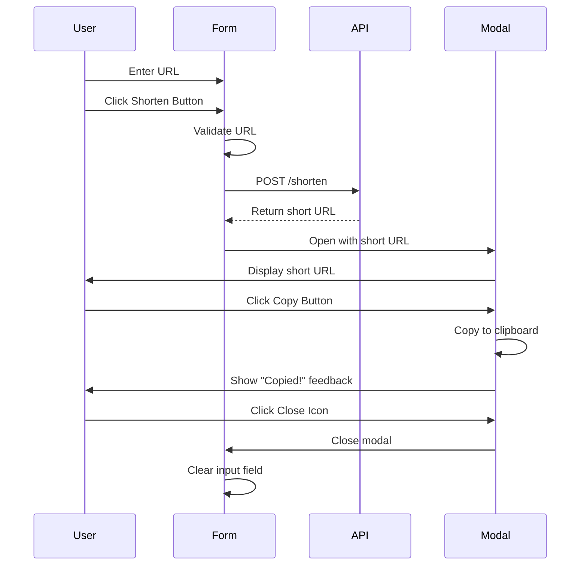

# Frontend Design Plan: Neon Cyberpunk URL Shortener

## Overview
A mobile-first, single-page React application with a neon cyberpunk theme for the URL shortener interface.

## Technology Stack
- **Framework**: React 18 with Vite
- **Styling**: CSS Modules with custom CSS variables
- **Build Tool**: Vite
- **Language**: JavaScript (ES6+)

## Design Theme: Neon Cyberpunk

### Color Palette
```css
--bg-primary: #0a0a0f;        /* Deep dark background */
--bg-secondary: #12121a;      /* Slightly lighter for cards */
--bg-tertiary: #1a1a25;       /* Input backgrounds */
--neon-cyan: #00f5ff;         /* Primary accent */
--neon-magenta: #ff00ff;      /* Secondary accent */
--neon-purple: #bf00ff;       /* Tertiary accent */
--text-primary: #ffffff;      /* Main text */
--text-secondary: #a0a0b0;    /* Secondary text */
--error: #ff3366;             /* Error state */
--success: #00ff88;           /* Success state */
```

### Visual Effects
- **Glow Effects**: Box shadows with neon colors
- **Gradients**: Linear gradients for buttons and backgrounds
- **Blur**: Backdrop blur for modal overlay
- **Animations**: Smooth transitions for all interactive elements

## Component Architecture

```
App
├── Header (Logo/Title)
├── URLShortenerForm
│   ├── URLInput
│   └── ShortenButton
└── Modal
    ├── CloseButton (top right)
    ├── ShortenedLinkDisplay
    └── CopyButton
```

## User Flow



## Component Specifications

### 1. App Component
**Purpose**: Main container and layout
**Responsibilities**:
- Manage global state (modal open/close, shortened link)
- Handle API communication
- Coordinate child components

**State**:
```javascript
{
  inputUrl: string,
  isModalOpen: boolean,
  shortUrl: string | null,
  isLoading: boolean,
  error: string | null,
  copySuccess: boolean
}
```

### 2. URLShortenerForm Component
**Purpose**: Input form for URL shortening
**Features**:
- Mobile-first responsive input field
- Glowing border on focus
- Gradient button with hover effects
- Loading state animation

**Props**:
```javascript
{
  onSubmit: (url: string) => Promise<void>,
  isLoading: boolean,
  error: string | null
}
```

### 3. Modal Component
**Purpose**: Display shortened link with copy functionality
**Features**:
- Backdrop blur overlay
- Smooth fade-in animation
- Close icon (X) in top-right corner
- Shortened link display with neon glow
- Copy button with success feedback

**Props**:
```javascript
{
  isOpen: boolean,
  shortUrl: string,
  onClose: () => void,
  onCopy: () => void,
  copySuccess: boolean
}
```

## API Integration

### POST /shorten
**Request**:
```javascript
{
  method: 'POST',
  headers: {
    'Content-Type': 'application/json',
    'X-Auth-Token': 'your-secret-token'
  },
  body: JSON.stringify({
    longUrl: 'https://example.com/very-long-url',
    customId: 'optional-custom-id'
  })
}
```

**Response**:
```javascript
{
  success: true,
  shortUrl: 'https://your-domain.com/abc123',
  id: 'abc123'
}
```

## Responsive Design Breakpoints

```css
/* Mobile First Approach */
/* Default: Mobile (320px - 767px) */
.container {
  padding: 1rem;
  max-width: 100%;
}

/* Tablet (768px - 1023px) */
@media (min-width: 768px) {
  .container {
    padding: 2rem;
    max-width: 600px;
  }
}

/* Desktop (1024px+) */
@media (min-width: 1024px) {
  .container {
    padding: 3rem;
    max-width: 800px;
  }
}
```

## File Structure

```
duck-short/
├── public/
│   └── vite.svg
├── src/
│   ├── components/
│   │   ├── URLShortenerForm.jsx
│   │   └── Modal.jsx
│   ├── App.jsx
│   ├── main.jsx
│   ├── index.css
│   └── App.module.css
├── index.html
├── package.json
├── vite.config.js
└── .gitignore
```

## Key Features Implementation

### 1. Copy to Clipboard
```javascript
const copyToClipboard = async (text) => {
  try {
    await navigator.clipboard.writeText(text);
    setCopySuccess(true);
    setTimeout(() => setCopySuccess(false), 2000);
  } catch (err) {
    console.error('Failed to copy:', err);
  }
};
```

### 2. URL Validation
```javascript
const isValidUrl = (string) => {
  try {
    new URL(string);
    return true;
  } catch (_) {
    return false;
  }
};
```

### 3. Modal Close & Clear Input
```javascript
const handleCloseModal = () => {
  setIsModalOpen(false);
  setInputUrl('');
  setShortUrl(null);
  setError(null);
};
```

## Animation Specifications

### Modal Animation
```css
.modal-overlay {
  animation: fadeIn 0.3s ease-out;
}

.modal-content {
  animation: slideUp 0.3s ease-out;
}

@keyframes fadeIn {
  from { opacity: 0; }
  to { opacity: 1; }
}

@keyframes slideUp {
  from {
    opacity: 0;
    transform: translateY(20px) scale(0.95);
  }
  to {
    opacity: 1;
    transform: translateY(0) scale(1);
  }
}
```

### Button Glow Effect
```css
.button-glow {
  box-shadow: 0 0 10px var(--neon-cyan),
              0 0 20px var(--neon-cyan),
              0 0 30px var(--neon-cyan);
  transition: all 0.3s ease;
}

.button-glow:hover {
  box-shadow: 0 0 20px var(--neon-cyan),
              0 0 40px var(--neon-cyan),
              0 0 60px var(--neon-cyan);
}
```

## Accessibility Considerations
- Semantic HTML elements
- ARIA labels for buttons
- Keyboard navigation support
- Focus indicators
- Sufficient color contrast
- Screen reader friendly

## Performance Optimizations
- Code splitting with React.lazy
- CSS modules for scoped styles
- Optimized images and assets
- Minimal bundle size
- Fast initial load

## Testing Checklist
- [ ] Mobile view (320px, 375px, 414px)
- [ ] Tablet view (768px, 1024px)
- [ ] Desktop view (1280px+)
- [ ] URL validation works correctly
- [ ] Copy to clipboard functions
- [ ] Modal opens/closes smoothly
- [ ] Input clears after modal close
- [ ] Error states display properly
- [ ] Loading states show correctly
- [ ] Keyboard navigation works
- [ ] Touch targets are adequate (44px+)
